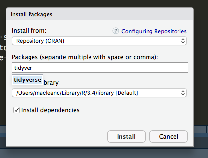

# Prerequisites

No specific knowledge is assumed for this book, though you will need to install some software.

  1. R
  2. RStudio
  3. The `tidyverse` packages
  
## Installing R

Follow this link and install the right version for your operating system [https://www.stats.bris.ac.uk/R/](https://www.stats.bris.ac.uk/R/)

## Installing RStudio

Follow this link and install the right version for your operating system [https://www.rstudio.com/products/rstudio/download/](https://www.rstudio.com/products/rstudio/download/)

## Installing R packages in RStudio

To install all the `tidyverse` packages in one go start RStudio and use the Packages tab in the lower-right panel. Click the install button (top left of the panel) and enter 'tidyverse', then click install as in this picture

To complete the quizzes you'll need a package called `nycflights13`. Install that in the same way.

